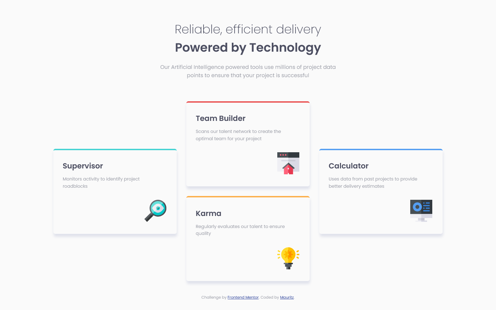

# Frontend Mentor - Four card feature section solution

This is a solution to the [Four card feature section challenge on Frontend Mentor](https://www.frontendmentor.io/challenges/four-card-feature-section-weK1eFYK). Frontend Mentor challenges help you improve your coding skills by building realistic projects. 

## Table of contents

- [Overview](#overview)
  - [The challenge](#the-challenge)
  - [Screenshot](#screenshot)
  - [Links](#links)
- [My process](#my-process)
  - [Built with](#built-with)
  - [What I learned](#what-i-learned)
  - [Continued development](#continued-development)
  - [Useful resources](#useful-resources)
- [Author](#author)

## Overview

### The challenge

Users should be able to:

- View the optimal layout for the site depending on their device's screen size

### Screenshot





### Links

- Solution URL: [solution URL](https://your-solution-url.com)
- Live Site URL: [live URL](https://mauritzlm.github.io/four-card-feature-section/)

## My process

### Built with

- Semantic HTML5 markup
- CSS custom properties
- Flexbox
- CSS Grid
- Mobile-first workflow

### What I learned

I used css grid to layout the ai cards section. I used grid-template areas and I learned that one can use a "." to create an empty grid cell.

```css
   .ai-types {
        display: grid;
        gap: 1.9em;
        grid-template-columns: 1fr 1fr 1fr;
        grid-template-areas:
            '  .         teambuilder      .    '
            'supervisor teambuilder calculator'
            'supervisor karma calculator'
            '    .       karma      .     ';
    }
```


### Continued development

I want to continue working with css grid and use it to build different types of layouts.

### Useful resources

- [css tricks complete guide to grid](https://css-tricks.com/snippets/css/complete-guide-grid/) - This guide is very helpful when working with css grid.

## Author

- Frontend Mentor - [@MauritzLM](https://www.frontendmentor.io/profile/yourusername)


